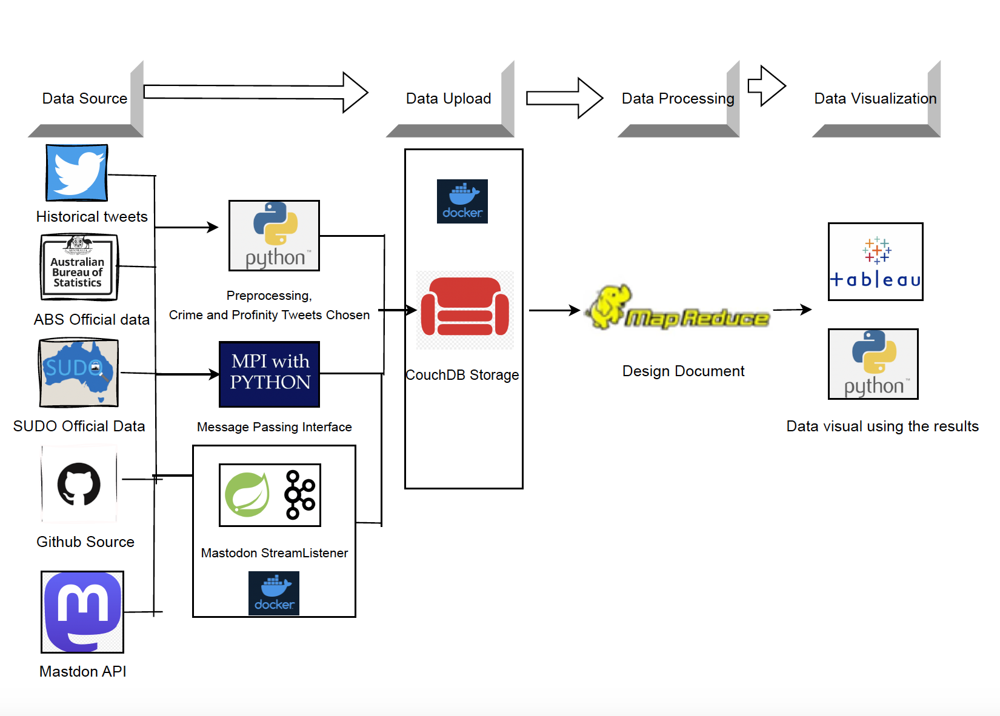
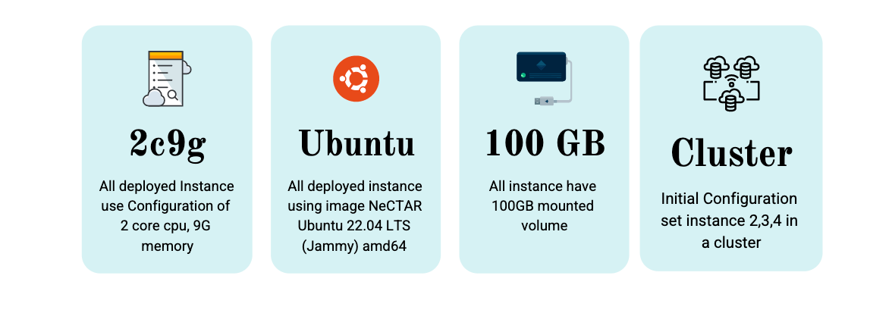
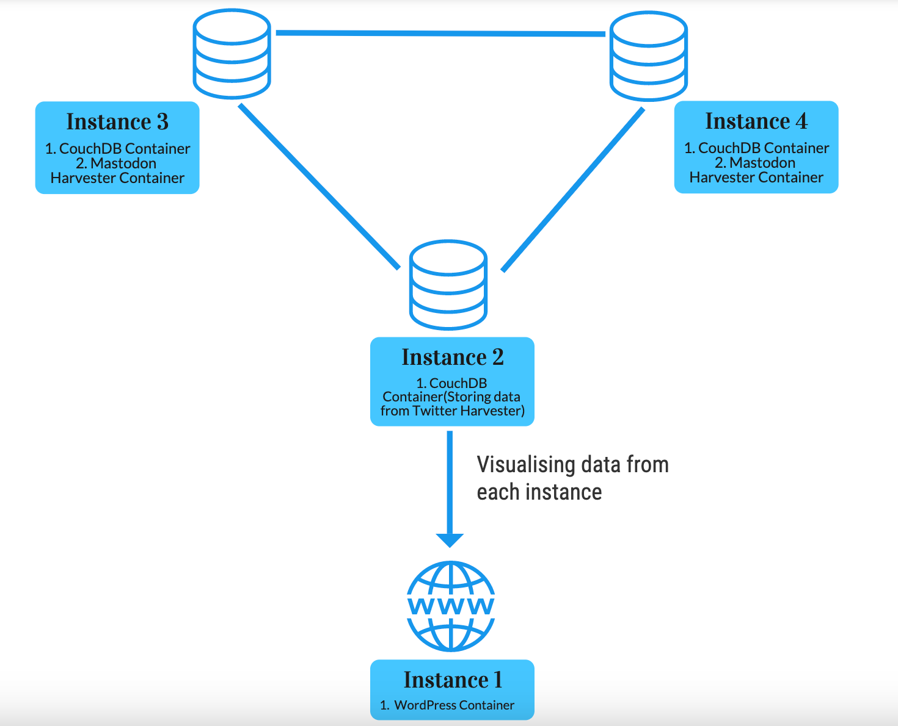

# CCC-ass2-team6
Welcome to the CCC-ass2-team6 repository. This repository is set up to allow you to deploy a ubuntu instance in MRC, deployed couchDB instance, and Wordpress instance in your cloud, run a Mastodon harvester in docker container, and perform regular disk usage checks on your instance. 
After deployed all necessary container, some python script could be help to produce some useful analysis of stream data and Twitter historical data, and the python script contains MapReduce function would help to distributed task of analysis into multiple process.
In addition, we also have necessary file that store the HTML and Javascript of the website.
# Getting Started
In planning stage, our initial deployment were planned as following picture:

# 1. Creating an Instance in your Cloud
In planning stage, the deployment of instance use following configuration:

First, navigate to the `ansible & docker/deploy_instance` directory.
```
cd ansible & docker/deploy_instance
```
Follow the instructions outlined in the README within this directory to create your instance.
# 2. Deploying Wordpress on your Instance
Next, navigate to the `ansible & docker/deploy_wordpress` directory.
```
cd ansible & docker/deploy_wordpress
```
# 3. Deploying the Mastodon Harvester
Once you have your instance set up with Wordpress, navigate to the `harvester (crawler)` directory.
```
cd harvester (crawler)
```
Follow the instructions in the README within this directory to deploy the Mastodon harvester.
After the deployment of above 3 stages, your node might works like below:

# 4. Deploying the Disk Usage Check Script(optional)
Finally, navigate to the `ansible & docker/error_handling` directory.
```
cd ansible & docker/error_handling
```
Follow the instructions in the README within this directory to deploy the shell script that regularly checks disk usage in your instance. If disk usage reaches 90%, the script will stop the container from collecting data to prevent overload.
# 5. Uploading the data to couchdb or creating any necessary analysis
Finally, navigate to the `data_processing_mapreduce & upload_to_couchdb` directory.
```
cd data_processing_mapreduce & upload_to_couchdb
```
Follow the instructions in the README within this directory.
# 6. Extracting the grouping data could plot the graph
navigate to the `graph_coding` directory. 
```
cd graph_coding
```
Following the readme in the folder would created the necessary data to plotting graph

