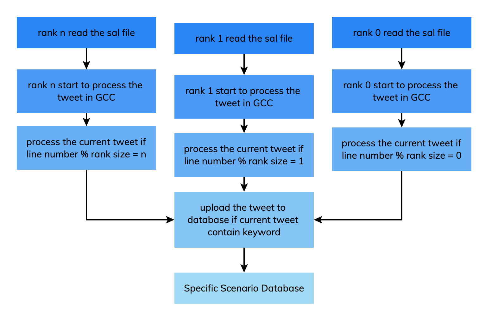

# Data preprocessing & MapReduce view creation
This following the readme in this page would creating the necessary data for you database and your analysis
# initial stage
Before entering into following stage
you should run the file `getGeoTweet.py` by following command:
```
python getGeoTweet.py
```
Above python script assume you have your own huge Tweet data in current directory,
and the data we need will extract to `upload_twitter_data`
# 1. Getting the data for CouchDB
Navigate to the file `upload_twitter_data`
```
cd upload_twitter_data
```
and our mpi upload pipeline are looks like below:

# 2. Uploading the SUDO related data to couchDB if you need(optional)
Navigate to the file `sudo_data_upload`
```
cd sudo_data_upload
```
# 3. Creating the view on each database through MapReduce function
Navigate to the file `mapreduce_create_view`
```
cd mapreduce_create_view
```
